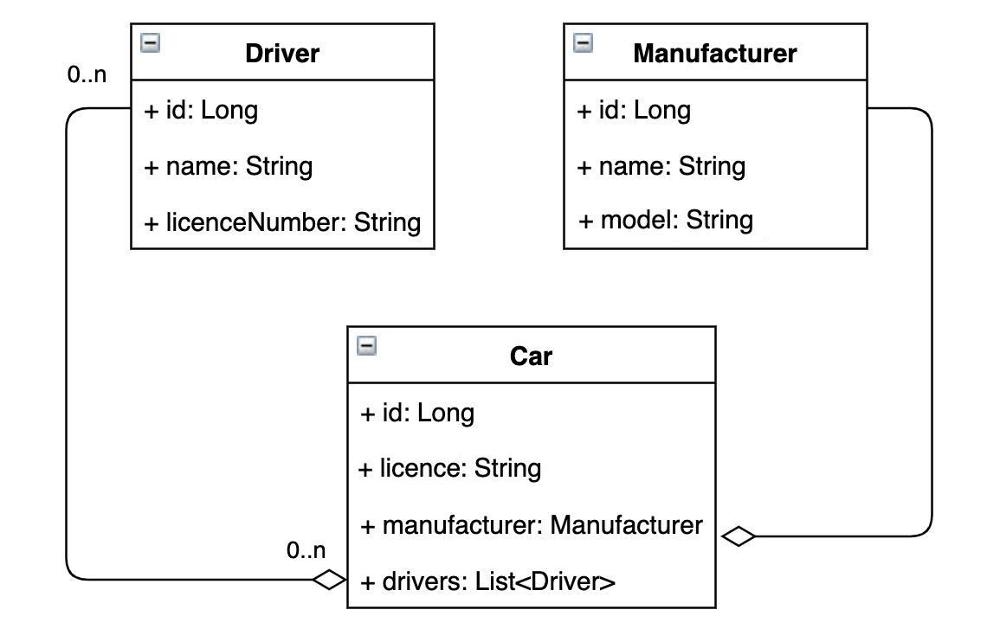
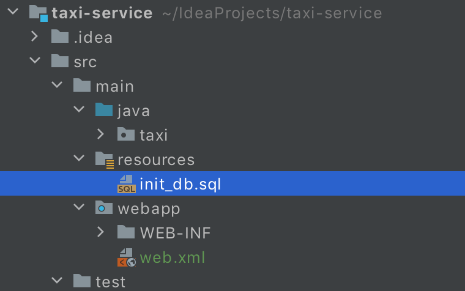
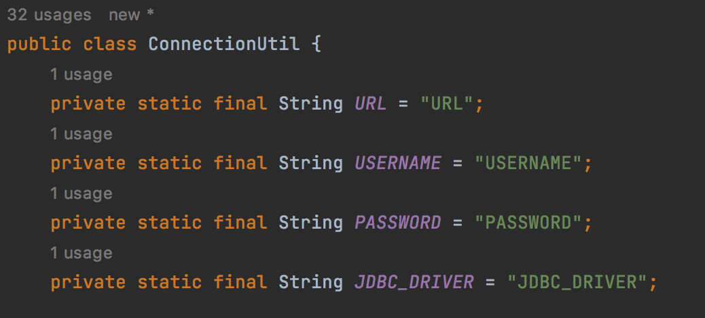
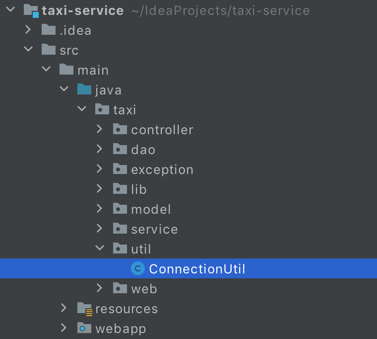
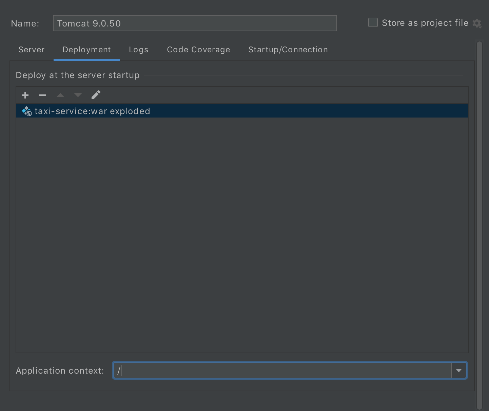

#  TAXI-SERVICE

#   DESCRIPTION

___________

This demo-project is a web-based application designed as a taxi service management system. 

It offers features such as user authentication, registration, and CRUD operations.

Built using Java, Servlet API, JDBC, JSP, HTML, and JSTL.

The application provides a user-friendly interface for managing various aspects of the taxi service:
manufacturers, cars drivers.

#   Features
___________
- Authentication  
- Add/delete/update drivers  
- Add/delete/update car models  
- Add/delete/update cars  
- Add drivers to specific cars  
- View all drivers  
- View all cars  
- View all cars by the current driver  

#  Structure
___________

#### Project 
<pre>
├───java 
│   └───taxi 
│       ├───controller         ---- User request processing controllers 
│       │   ├───car 
│       │   ├───driver 
│       │   ├───manufacturer
│       │   └───login
│       ├───dao                ---- The dao layer facilitates data management operations
│       ├───exception          ---- Custom exceptions
│       │   ├───authentication 
│       │   ├───data processing
│       │   └───duplicate                    
│       ├───lib                ---- Annotations and an injector for fields initialization  
│       ├───model              ---- Project models 
│       │   ├───car 
│       │   ├───driver 
│       │   ├───manager
│       │   └───manufacturer             
│       ├───service             ---- The service layer encapsulates the business logic 
│       ├───util                ---- Connection to the database 
│       └───web                 ---- Filter for authorisation
│           └───filter               control and restrict access to resources
├───resources                   ---- SQL script for creating taxi-service schema 
└───webapp                      ---- The web layer manage interactions within the application   
    └───WEB-INF
        ├───views               ---- JSP pages serve as dynamic web content                     
        │   ├───cars                         
        │   │   └───drivers  
        │   ├───css
        │   ├───drivers
        │   ├───manufacturers
        │   ├───index(menu)
        │   └───login
        └───web                  ---- Java web app configuration file

</pre>

#### Database

#  Used Technologies
___________
- Java 11  
- MAVEN 4.0.0  
- MYSQL 8.0.22  
- JDBC  
- SERVLET 4.0.1  
- JSP  
- JSTL 1.2  
- CSS  
- TOMCAT 9.0.7

#  Getting Started
___________
#### Prerequisites:
- Java 17 or later
- Apache Tomcat 9 (version 9.0.73 is recommended)
- MySQL 8 or later
#### Install process
1. Clone this repository.
2. Open the project in your IDE and build it.
3. Create the database schema and tables using src/main/resources/init_db.sql.
   
4. Change the information about database connection in src/main/java/taxi/util/ConnectionUtil.java.
    
    
5. Configure Tomcat. 
    #### Use only Tomcat 9
   - choose war exploded  
   - leave only "/" in the application context  
   
6. To launch the application you need to add a new manager (name, login and password) to the database.
7. Launch and use.

